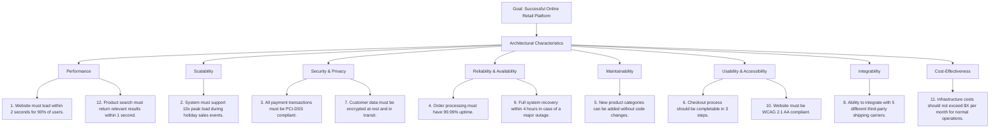
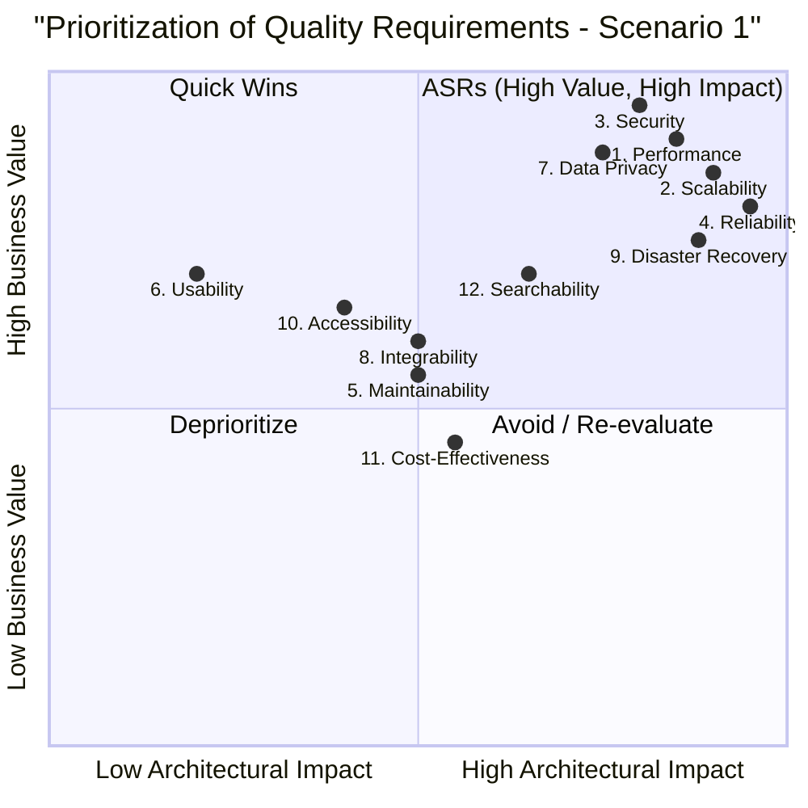

### **Scenario 1: Online Retail Platform - Exemplar Answer**

#### **Quality Tree**

```mermaid
graph TD
    A[Goal: Successful Online Retail Platform] --> AA[Architectural Characteristics]

    AA --> B[Performance]
    AA --> C[Scalability]
    AA --> D[Security & Privacy]
    AA --> E[Reliability & Availability]
    AA --> F[Maintainability]
    AA --> G[Usability & Accessibility]
    AA --> H[Integrability]
    AA --> I[Cost-Effectiveness]

    B --> Q1[1. Website must load within 2 seconds for 90% of users.]
    B --> Q12[12. Product search must return relevant results within 1 second.]

    C --> Q2[2. System must support 10x peak load during holiday sales events.]

    D --> Q3[3. All payment transactions must be PCI-DSS compliant.]
    D --> Q7[7. Customer data must be encrypted at rest and in transit.]

    E --> Q4[4. Order processing must have 99.99% uptime.]
    E --> Q9[9. Full system recovery within 4 hours in case of a major outage.]

    F --> Q5[5. New product categories can be added without code changes.]

    G --> Q6[6. Checkout process should be completable in 3 steps.]
    G --> Q10[10. Website must be WCAG 2.1 AA compliant.]

    H --> Q8[8. Ability to integrate with 5 different third-party shipping carriers.]

    I --> Q11[11. Infrastructure costs should not exceed $X per month for normal operations.]
```

#### **Prioritization Quadrant Diagram**

```mermaid
quadrantChart
  title "Prioritization of Quality Requirements - Scenario 1"
  x-axis "Low Architectural Impact" --> "High Architectural Impact"
  y-axis "Low Business Value" --> "High Business Value"
  quadrant-1 "ASRs (High Value, High Impact)"
  quadrant-2 "Quick Wins"
  quadrant-3 "Deprioritize"
  quadrant-4 "Avoid / Re-evaluate"
  1. Performance: [0.85, 0.9]
  2. Scalability: [0.9, 0.85]
  3. Security: [0.8, 0.95]
  4. Reliability: [0.95, 0.8]
  5. Maintainability: [0.5, 0.55]
  6. Usability: [0.2, 0.7]
  7. Data Privacy: [0.75, 0.88]
  8. Integrability: [0.5, 0.6]
  9. Disaster Recovery: [0.88, 0.75]
  10. Accessibility: [0.4, 0.65]
  11. Cost-Effectiveness: [0.55, 0.45]
  12. Searchability: [0.65, 0.7]
```