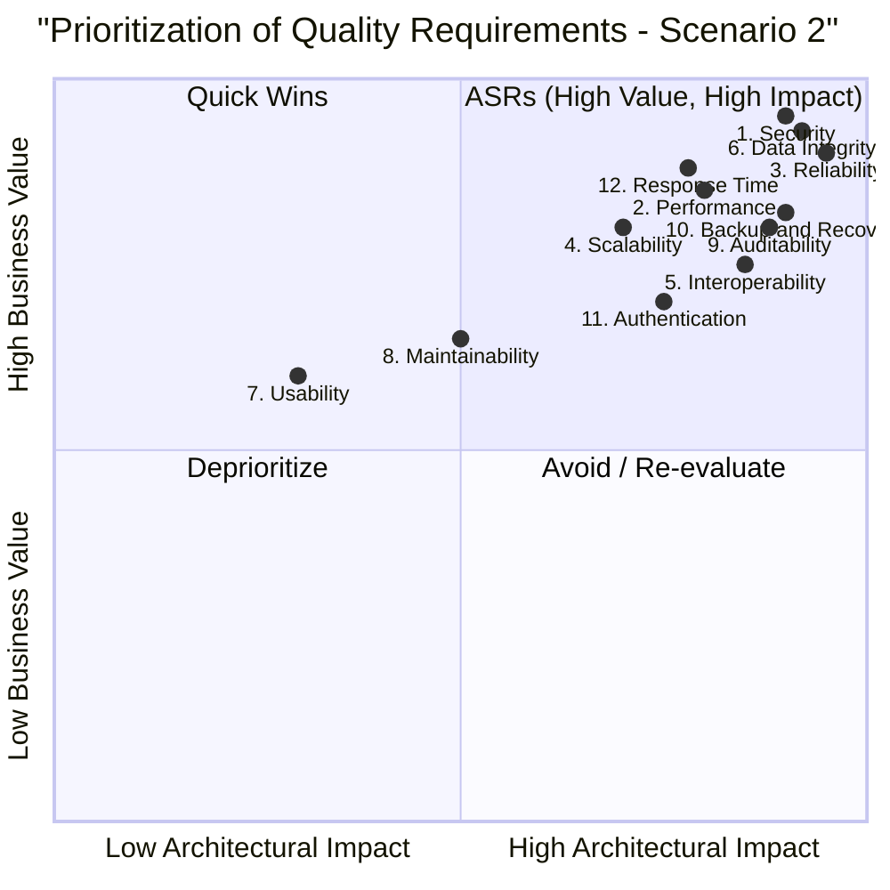

### **Scenario 2: Healthcare Management System - Exemplar Answer**

#### **Quality Tree**

```mermaid
graph TD
    A[Goal: Robust & Compliant Healthcare System] --> AA[Architectural Characteristics]

    AA --> B[Security & Compliance]
    AA --> C[Performance]
    AA --> D[Reliability & Availability]
    AA --> E[Scalability]
    AA --> F[Interoperability]
    AA --> G[Data Integrity]
    AA --> H[Usability]
    AA --> I[Maintainability]

    B --> Q1[1. Patient data access must be HIPAA compliant and auditable.]
    B --> Q9[9. All user actions on patient records must be logged.]
    B --> Q11[11. Support multi-factor authentication for all users.]

    C --> Q2[2. Retrieving a patient\'s full medical history must take less than 1 second.]
    C --> Q12[12. Critical alerts for patient vitals must be delivered within 500ms.]

    D --> Q3[3. System must be available 24/7 with minimal downtime for critical functions.]
    D --> Q10[10. Backups with a 1-hour RTO and 30-minute RPO.]

    E --> Q4[4. Must support a growing number of hospitals and clinics, each with thousands of patients.]

    F --> Q5[5. Ability to exchange patient data with external lab systems using FHIR standards.]

    G --> Q6[6. Prevent unauthorized alteration of patient records.]

    H --> Q7[7. Doctors must be able to input consultation notes quickly and efficiently.]

    I --> Q8[8. Updates to medical coding standards (e.g., ICD-10) should be easily configurable.]
```

#### **Prioritization Quadrant Diagram**

