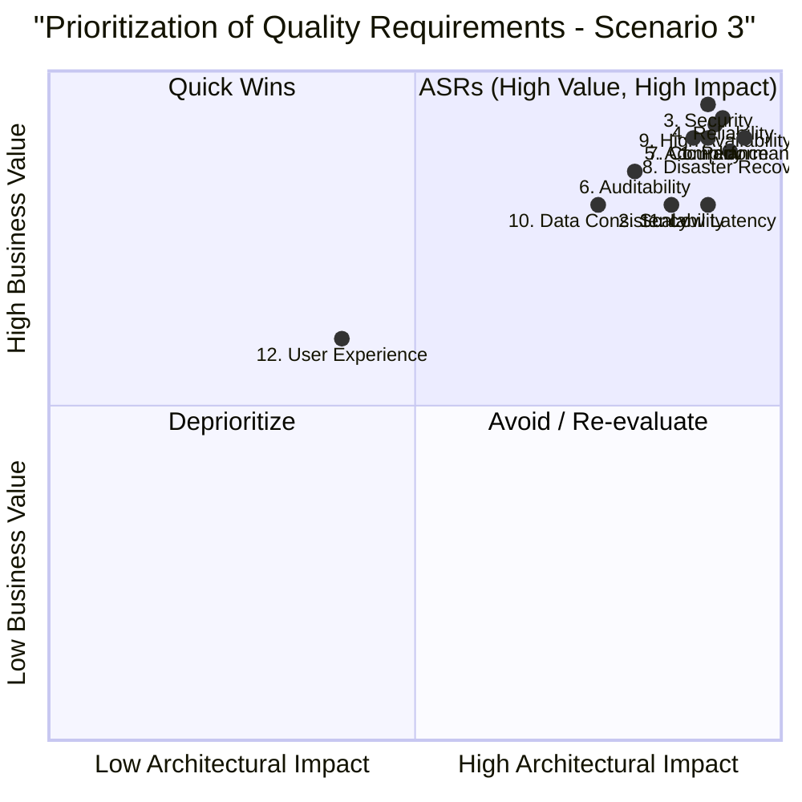

### **Scenario 3: Financial Trading Platform - Exemplar Answer**

#### **Quality Tree**

```mermaid
graph TD
    A[Goal: High-Performance Financial Trading] --> B[Core Trading Capabilities]
    A --> C[Regulatory & Trust]
    A --> D[System Robustness]

    B --> B1[Execution Speed]
    B --> B2[Market Data]
    B --> B3[User Experience]

    C --> C1[Compliance]
    C --> C2[Data Integrity & Audit]
    C --> C3[Security]

    D --> D1[Availability]
    D --> D2[Recovery]
    D --> D3[Scalability]

    B1 --> Q1[1. Performance: Trade execution latency must be less than 50ms.]
    B2 --> Q11[11. Low Latency (Market Data): Market data feeds must be processed and displayed within 100ms.]
    B2 --> Q10[10. Data Consistency: Real-time market data must be consistent across all user interfaces.]
    B3 --> Q12[12. User Experience: Intuitive interface for complex trading strategies.]

    C1 --> Q7[7. Compliance: Adherence to all relevant financial regulations (e.g., MiFID II, FINRA).]
    C2 --> Q5[5. Accuracy: All financial calculations must be precise to 8 decimal places.]
    C2 --> Q6[6. Auditability: Every trade and account activity must be traceable and auditable.]
    C3 --> Q3[3. Security: All financial transactions must be encrypted and fraud-resistant.]

    D1 --> Q9[9. High Availability: 99.999% uptime for core trading functions.]
    D2 --> Q4[4. Reliability (Zero Data Loss): Zero data loss for all executed trades.]
    D2 --> Q8[8. Disaster Recovery: Full platform recovery within 15 minutes of a major incident.]
    D3 --> Q2[2. Scalability: System must handle 10,000 concurrent active traders.]
```

#### **Prioritization Quadrant Diagram**


