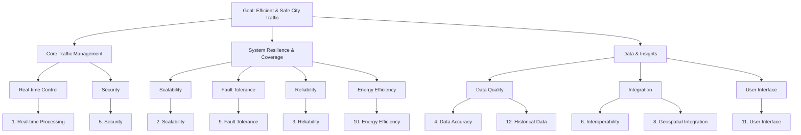
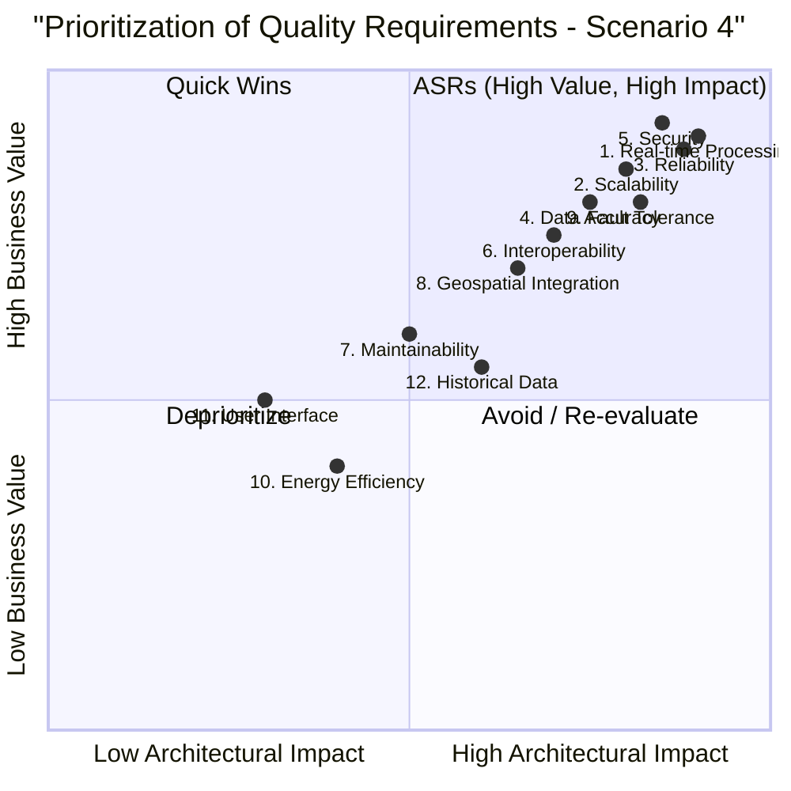

### **Scenario 4: Smart City Traffic Management System - Exemplar Answer**

#### **Quality Tree**

```mermaid
graph TD
    A[Goal: Efficient & Safe City Traffic] --> B[Core Traffic Management]
    A --> C[System Resilience & Coverage]
    A --> D[Data & Insights]

    B --> B1[Real-time Control]
    B --> B2[Security]

    C --> C1[Scalability]
    C --> C2[Fault Tolerance]
    C --> C3[Reliability]
    C --> C4[Energy Efficiency]

    D --> D1[Data Quality]
    D --> D2[Integration]
    D --> D3[User Interface]

    B1 --> Q1[1. Real-time Processing]
    B2 --> Q5[5. Security]

    C1 --> Q2[2. Scalability]
    C2 --> Q9[9. Fault Tolerance]
    C3 --> Q3[3. Reliability]
    C4 --> Q10[10. Energy Efficiency]

    D1 --> Q4[4. Data Accuracy]
    D1 --> Q12[12. Historical Data]
    D2 --> Q6[6. Interoperability]
    D2 --> Q8[8. Geospatial Integration]
    D3 --> Q11[11. User Interface]
```

#### **Prioritization Quadrant Diagram**

```mermaid
quadrantChart
  title "Prioritization of Quality Requirements - Scenario 4"
  x-axis "Low Architectural Impact" --> "High Architectural Impact"
  y-axis "Low Business Value" --> "High Business Value"
  quadrant-1 "ASRs (High Value, High Impact)"
  quadrant-2 "Quick Wins"
  quadrant-3 "Deprioritize"
  quadrant-4 "Avoid / Re-evaluate"
  1. Real-time Processing: [0.9, 0.9]
  2. Scalability: [0.8, 0.85]
  3. Reliability: [0.88, 0.88]
  4. Data Accuracy: [0.75, 0.8]
  5. Security: [0.85, 0.92]
  6. Interoperability: [0.7, 0.75]
  7. Maintainability: [0.5, 0.6]
  8. Geospatial Integration: [0.65, 0.7]
  9. Fault Tolerance: [0.82, 0.8]
  10. Energy Efficiency: [0.4, 0.4]
  11. User Interface: [0.3, 0.5]
  12. Historical Data: [0.6, 0.55]
```