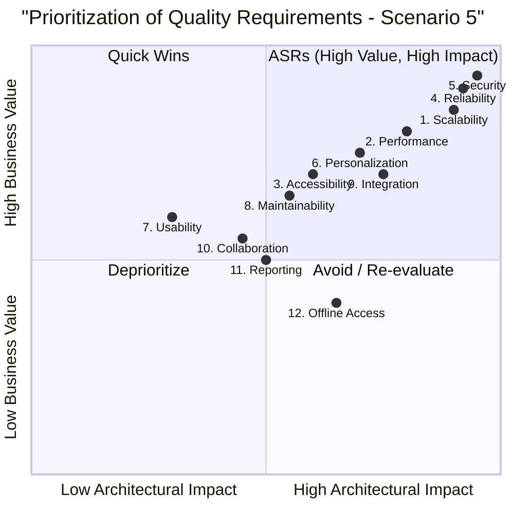

### **Scenario 5: Educational Learning Platform - Exemplar Answer**

#### **Quality Tree**

```mermaid
graph TD
    A[Goal: Engaging & Effective Learning Platform] --> B[Learner Experience]
    A --> C[Platform Management]
    A --> D[Data Security & Privacy]

    B --> B1[Content Delivery]
    B --> B2[Interaction & Engagement]
    B --> B3[Accessibility]

    C --> C1[Scalability & Performance]
    C --> C2[System Reliability]
    C --> C3[Course Management]
    C --> C4[Integration]

    D --> D1[Security & Privacy]

    B1 --> Q2[2. Performance (Video/Exercises)]
    B1 --> Q12[12. Offline Access]
    B2 --> Q6[6. Personalization]
    B2 --> Q10[10. Collaboration]
    B3 --> Q3[3. Accessibility]
    B3 --> Q7[7. Usability]

    C1 --> Q1[1. Scalability]
    C1 --> Q4[4. Reliability (Progress/Grades)]
    C2 --> Q8[8. Maintainability]
    C3 --> Q11[11. Reporting]
    C4 --> Q9[9. Integration]

    D1 --> Q5[5. Security (PII/Records)]
```

#### **Prioritization Quadrant Diagram**

