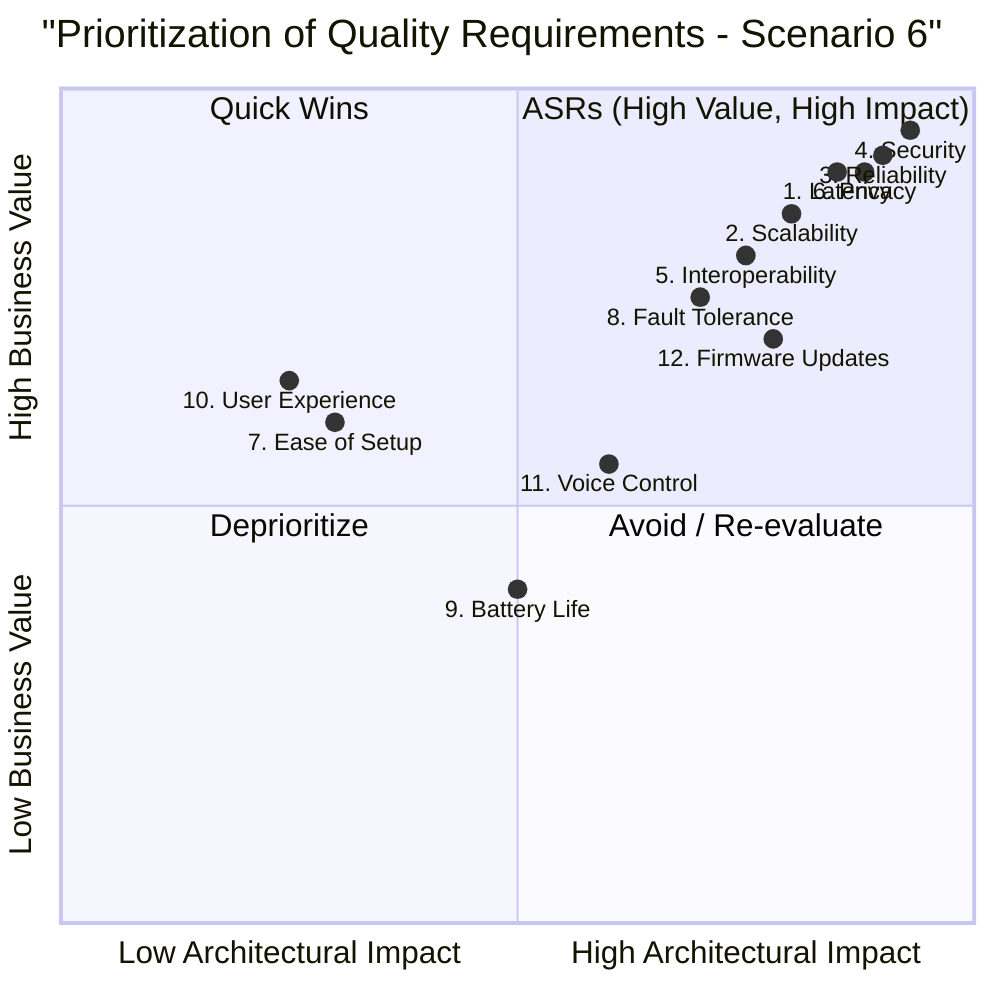

### **Scenario 6: IoT Smart Home System - Exemplar Answer**

#### **Quality Tree**

```mermaid
graph TD
    A[Goal: Reliable & Secure Smart Home] --> B[Device Interactivity]
    A --> C[System Resilience]
    A --> D[Data & Control]
    A --> E[User Experience]

    B --> B1[Communication Speed]
    B1 --> Q1[1. Latency]

    C --> C1[Scalability]
    C1 --> Q2[2. Scalability]
    C1 --> Q8[8. Fault Tolerance]
    C1 --> Q9[9. Battery Life]

    D --> D1[Security & Privacy]
    D1 --> Q4[4. Security]
    D1 --> Q6[6. Privacy]
    D1 --> Q12[12. Firmware Updates]

    E --> E1[Usability]
    E1 --> Q7[7. Ease of Setup]
    E1 --> Q10[10. User Experience]
    E1 --> Q11[11. Voice Control]

    F[Core Automation] --> Q3[3. Reliability (Routines)]
    G[Device Compatibility] --> Q5[5. Interoperability]
```

#### **Prioritization Quadrant Diagram**


