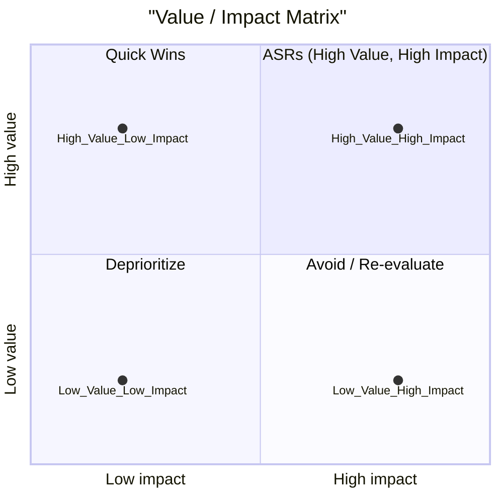
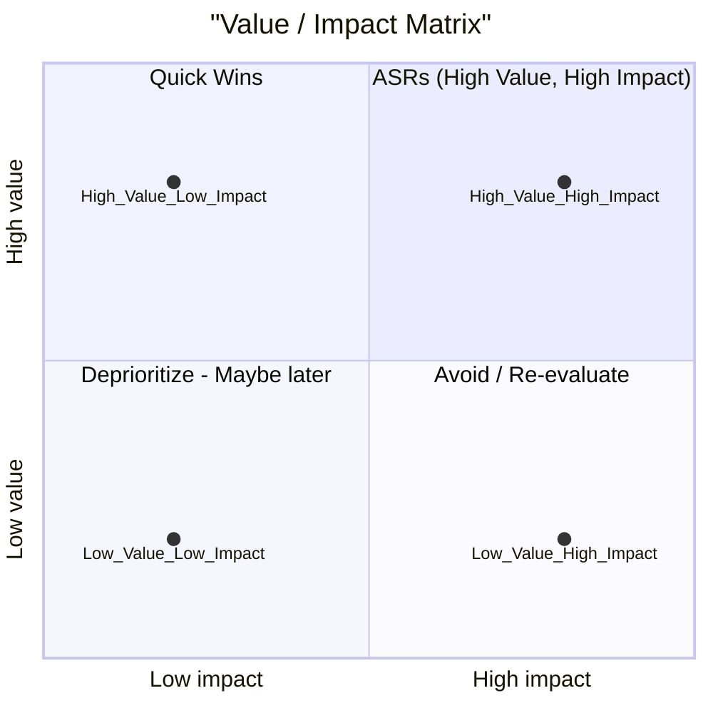

# Module 3: Prioritization & Impact Assessment

---

## Prioritization and Impact Assessment

### *Using the (Value / Effort) Matrix to Find Your ASRs*

**Duration:** 1.5 hours

**Format:** Theory + Case Study Analysis

---

## Learning Objectives

By the end of this module, you will be able to:

- **Evaluate** each quality requirement on two dimensions:
  - Business Value (High / Medium / Low)
  - Architectural Impact (High / Medium / Low)
- **Identify** Architecturally Significant Requirements (ASRs) in the High/High quadrant
- **Explain** why ASRs are the only requirements that matter for architecture
- **Defend** architectural decisions using data-backed priority matrices
- **Allocate** your engineering "innovation tokens" strategically
- **Communicate** architectural scope to stakeholders using visual frameworks

---

## Why You Need to Know This

Every epic is not created equal, yet most teams treat them the same.

As a lead developer, you face constant pressure:

- **"Just add one more feature"** (feature creep that breaks your architecture)
- **"Why is this taking so long?"** (because you're optimizing for low-impact requirements)
- **"Can we do both?"** (no—architecture forces trade-offs)
- **"We need High Value AND High Effort"** (the matrix forces honest conversations)

**This module teaches you to protect the architecture from death by a thousand tiny cuts.**

By mapping every requirement to the Value/Impact matrix, you can say "no" to the low-impact features and say "yes" to the ASRs that actually matter. You'll have a data-backed answer for every stakeholder question.

---

## The Challenge of Prioritization

*   **Limited Resources:** Time, budget, and engineering capacity are finite.
*   **Conflicting Demands:** Stakeholders often have competing priorities.
*   **Vague Requirements:** "Make it fast" or "make it secure" don't help in decision-making.
*   **Technical Debt:** Prioritizing incorrectly can lead to long-term architectural issues.

**Goal:** Move from subjective opinions to objective, data-driven decisions.

---

## Introducing the Value/Impact Matrix

*   **A Simple Tool, Powerful Insights:** A 2x2 grid for evaluating requirements.
*   **Two Key Dimensions:**
    *   **Business Value:** How important is this to the user, customer, or business goals?
    *   **Architectural Impact:** How much effort, risk, and change does this require for the architecture?
*   **Purpose:** To clearly visualize trade-offs and identify the most critical items.

---

## Visualizing the Value/Impact Matrix

ASRs - Architecturally Significant Requirements

---

## Defining "Business Value" (H/M/L)

*   **High Value:** Directly impacts critical business outcomes (e.g., revenue, user acquisition, legal compliance, competitive advantage). Failure to deliver has significant negative consequences.
    *   *Examples:* Core payment functionality, user login, critical data privacy features.
*   **Medium Value:** Important for user satisfaction, efficiency, or non-critical business processes.
    *   *Examples:* Advanced search filters, detailed analytics dashboards, minor UI/UX improvements.
*   **Low Value:** "Nice-to-have" features, minor improvements, or internal tooling with limited impact.
    *   *Examples:* Cosmetic UI changes, niche reporting features, highly specialized internal scripts.

**How to Assess:** Consult product owners, business analysts, and user research.

---

## Defining "Architectural Impact" (H/M/L)

*   **High Impact:** Requires significant changes to core architectural components, infrastructure, data models, or introduces new complex technologies/dependencies. High risk of introducing bugs or performance regressions.
    *   *Examples:* Migrating to a new database, re-architecting a microservice, integrating a new third-party payment gateway.
*   **Medium Impact:** Involves changes within existing architectural boundaries but may require moderate refactoring, new service endpoints, or significant testing.
    *   *Examples:* Adding a new API endpoint, extending an existing service with new business logic, minor database schema changes.
*   **Low Impact:** Can be implemented with minimal changes to the existing codebase or infrastructure. Low risk.
    *   *Examples:* UI text changes, adding a new field to an existing form, small bug fixes within a single component.

**How to Assess:** Consult architects, senior developers, and infrastructure teams.

---

## The Matrix Quadrants: Low Value / Low Impact

### *The "Maybe Later" or "Delete" Quadrant*

*   **Characteristics:** Low importance, easy to implement.
*   **Action:**
    *   **Deprioritize:** These should be at the bottom of the backlog.
    *   **Re-evaluate:** Is it truly low value, or is there a hidden benefit?
    *   **Delete:** If it offers no significant return, don't waste any resources on it.
*   **Pitfall:** Can become "busy work" that consumes resources without delivering real value.

---

## The Matrix Quadrants: High Value / Low Impact

### *The "Quick Wins" Quadrant*

*   **Characteristics:** High importance, easy to implement.
*   **Action:**
    *   **Prioritize Immediately:** These deliver maximum value for minimal effort.
    *   **Capture Momentum:** Completing these builds confidence and demonstrates progress.
    *   **Watch Out:** Ensure the "low impact" assessment is accurate and doesn't hide future technical debt.
*   **Examples:** Performance optimizations requiring minor code changes, critical bug fixes with clear solutions, small but impactful UX improvements.

---

## The Matrix Quadrants: Low Value / High Impact

### *The "Avoid" or "Re-evaluate" Quadrant*

*   **Characteristics:** Low importance, difficult to implement.
*   **Action:**
    *   **Strongly Avoid:** These are resource sinks that deliver little return.
    *   **Question Relentlessly:** Why is this being considered? What is the real underlying need?
    *   **Seek Alternatives:** Can the business goal be met with a lower-impact solution?
*   **Pitfall:** Can be driven by a single stakeholder's pet project or a misunderstanding of architectural costs. These are often where "death by a thousand tiny cuts" begins.

---

## The Matrix Quadrants: High Value / High Impact

### *Architecturally Significant Requirements (ASRs)*

*   **Characteristics:** Critical business value, high architectural changes required.
*   **Action:**
    *   **Top Priority:** These are the foundational elements of your system.
    *   **Careful Design:** Require significant architectural planning, design reviews, and often proof-of-concepts.
    *   **Dedicated Resources:** Allocate experienced engineers and sufficient time.
*   **These are your "Innovation Tokens":** Where you spend your most valuable architectural effort.
*   **Ignoring them leads to project failure.**

---

## Deep Dive: Understanding ASRs

*   **Definition:** Requirements that have a direct and profound impact on the system's architecture. They shape the fundamental structure, technologies, and patterns.
*   **Not Just Features:** ASRs often relate to quality attributes (performance, security, scalability, reliability, maintainability) rather than specific functional features.
*   **Examples:**
    *   "The system must handle 1 million concurrent users with <100ms response time." (Performance, Scalability)
    *   "All user data must be encrypted at rest and in transit using AES-256." (Security)
    *   "The system must maintain 99.999% uptime with no more than 5 minutes of downtime per year." (Availability)

---

## Working with ASRs

*   **Architectural Ownership:** ASRs are primarily the responsibility of architects and lead developers.
*   **Early Engagement:** Identify and address ASRs early in the project lifecycle.
*   **Design & Validation:** Document architectural decisions, run performance tests, security audits, and load tests specifically for ASRs.
*   **Iterative Approach:** Break down large ASRs into smaller, manageable spikes or phases.

---

## Facilitating the Matrix Discussion

*   **Neutral Facilitator:** Guide the discussion without imposing personal bias.
*   **Diverse Group:** Include product, engineering, QA, and operations representatives.
*   **Clear Definitions:** Ensure everyone understands "High/Medium/Low" for both dimensions.
*   **Focus on Trade-offs:** Encourage honest conversations about costs and benefits.
*   **Visualize:** Use whiteboards, sticky notes, or digital tools to build the matrix collaboratively.

---

## Communicating Prioritization Decisions

*   **Visual Representation:** Present the Value/Impact Matrix to stakeholders.
*   **Data-Backed Justification:** Explain *why* certain items are prioritized or deprioritized.
*   **Manage Expectations:** Clearly communicate what will be delivered and when, and what won't.
*   **Highlight ASRs:** Emphasize the critical architectural investments being made.
*   **Iterate:** The matrix is a living document and should be reviewed periodically.

---

## Practical Exercise / Case Study Introduction

To solidify your understanding of the Value/Impact Matrix and ASRs, we will now introduce a practical exercise. You'll work through a mini-case study to apply these concepts to real-world scenarios.

---

## Summary & Key Takeaways

*   **Prioritization is Key:** In resource-constrained environments, effective prioritization is crucial for architectural success.
*   **Value/Impact Matrix:** A powerful, visual tool for evaluating requirements based on Business Value and Architectural Impact.
*   **ASRs are Foundational:** High Value / High Impact items (ASRs) are the Architecturally Significant Requirements that demand early, careful attention and significant resources.
*   **Avoid Low Value / High Impact:** These are project killers.
*   **Embrace High Value / Low Impact:** Quick wins build momentum.
*   **Communicate Visually:** Use the matrix to drive conversations and align stakeholders.
